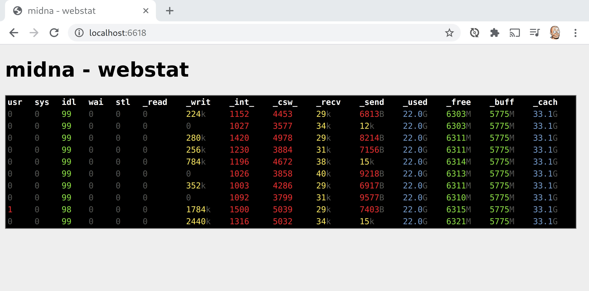

# gokrazy/stat

`gokrazy/stat` is a program to visualize resource usage, producing output that
looks very similar to [Dag Wieers’s
`dstat`](https://github.com/dstat-real/dstat) default output.

As the repository path implies, this program is meant to be used on the
https://gokrazy.org/ Raspberry Pi platform, so it does not have any external
runtime dependencies and is implemented natively in Go (not using any cgo). The
resulting static binary might come in handy in other Linux environments, too!

## github.com/gokrazy/stat/cmd/gokr-webstat

`gokr-webstat` displays system resource usage in your browser, with output
matching `gokr-stat` or `dstat`!

It uses the [EventSource
API](https://developer.mozilla.org/en-US/docs/Web/API/EventSource) to stream new
lines into your browser.

## github.com/gokrazy/stat/cmd/gokr-stat

The `gokr-stat` program is a terminal program that displays system resource
usage, like `dstat`.

Here is the `gokr-stat` terminal output (via
[`gokrazy/breakglass`](https://github.com/gokrazy/breakglass)) when scanning one
double-sided piece of A4 paper with
[scan2drive](https://github.com/stapelberg/scan2drive) on a Raspberry Pi 4:

